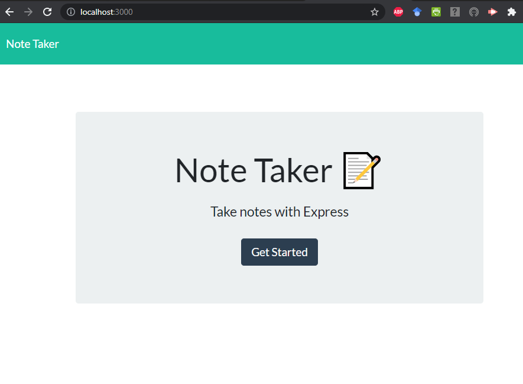
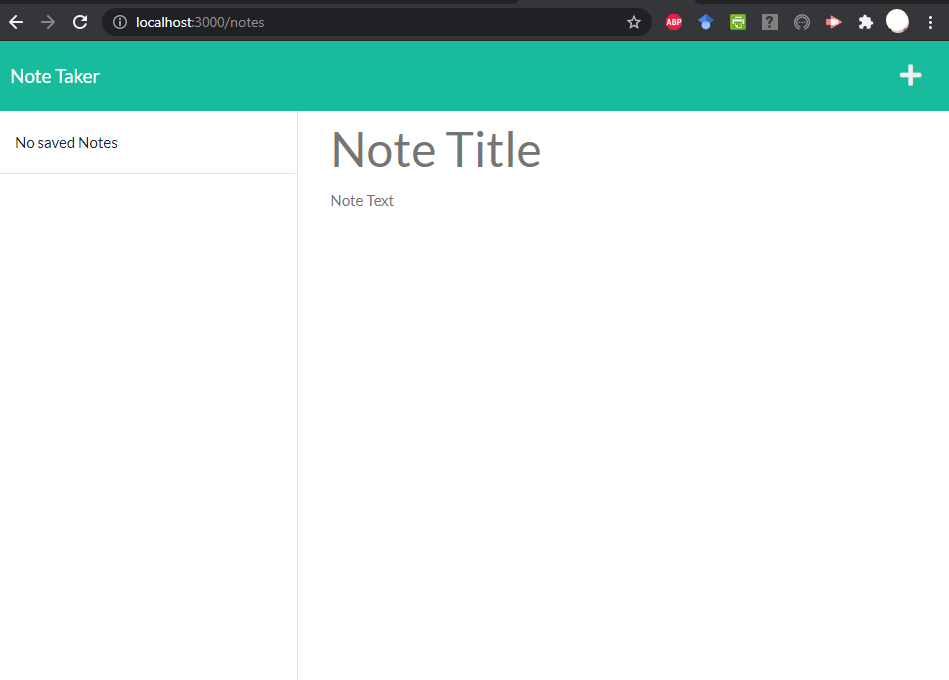

# Note-Taker
[](https://opensource.org/licenses/MIT)


## Description
This application is run with Node.js and Express.js. The user can create and save notes with this web application. They can accesss and view their saved notes and delete notes with a simple click. 

## Table of Contents

* [License](#license)

* [Installation](#installation)

* [Usage](#usage)

* [Credits](#credits)

* [Questions](#questions)

---

## License

This project is licensed under the MIT License. To learn more visit:   
> [MIT License](https://github.com/git/git-scm.com/blob/main/MIT-LICENSE.txt)

## Installation

To install Express.js run this command:

```
npm i express
```

## Usage

To initialize the app, right-click on the index.js file and choose 'Open in Integrated Terminal'.

In the command line type the following and press enter:

```
node index.js
```

On your preferred browser, type this in your search bar and press enter:

```
localhost:3000
```

Click on Get Started and then create and save your notes!




> For a demo of this application, [Watch Here]()

## Credits

MIT badge was accessed from GitHub user [Lukas Himsel](https://gist.github.com/lukas-h/2a5d00690736b4c3a7ba)

## Questions

If you have any questions, please contact me at: paolaagonzalezm@email.arizona.edu.